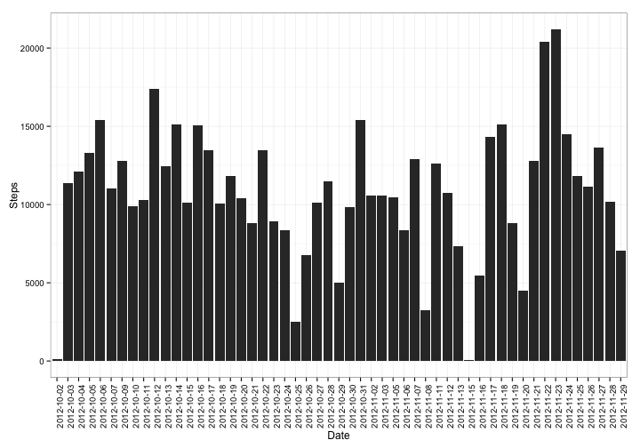

# Assignment 1
========================================================

## Loading and preprocessing data


```r
activity <- read.csv("activity.csv")
```


## What is mean total number of steps taken per day?


```r
mean(na.omit(activity$steps))
```

```
## [1] 37.38
```


### 1. Histogram of the number of steps taken each day


```r
library(ggplot2)
steps_by_date <- aggregate(steps ~ date, data = activity, FUN = sum)
ggplot(steps_by_date, aes(x = date, y = steps)) + geom_bar(stat = "identity") + 
    theme_bw() + theme(axis.text.x = element_text(angle = 90, hjust = 1)) + 
    xlab("Date") + ylab("Steps")
```

 


### 2. The mean and median total number of steps taken per day


```r
library(doBy)
```

```
## Loading required package: multcomp
## Loading required package: mvtnorm
## Loading required package: survival
## Loading required package: splines
## Loading required package: MASS
```

```r
steps_by_date_summary <- summaryBy(steps ~ date, data = activity, FUN = c(mean, 
    median), na.rm = T)
steps_by_date_summary
```

```
##          date steps.mean steps.median
## 1  2012-10-01        NaN           NA
## 2  2012-10-02     0.4375            0
## 3  2012-10-03    39.4167            0
## 4  2012-10-04    42.0694            0
## 5  2012-10-05    46.1597            0
## 6  2012-10-06    53.5417            0
## 7  2012-10-07    38.2465            0
## 8  2012-10-08        NaN           NA
## 9  2012-10-09    44.4826            0
## 10 2012-10-10    34.3750            0
## 11 2012-10-11    35.7778            0
## 12 2012-10-12    60.3542            0
## 13 2012-10-13    43.1458            0
## 14 2012-10-14    52.4236            0
## 15 2012-10-15    35.2049            0
## 16 2012-10-16    52.3750            0
## 17 2012-10-17    46.7083            0
## 18 2012-10-18    34.9167            0
## 19 2012-10-19    41.0729            0
## 20 2012-10-20    36.0938            0
## 21 2012-10-21    30.6285            0
## 22 2012-10-22    46.7361            0
## 23 2012-10-23    30.9653            0
## 24 2012-10-24    29.0104            0
## 25 2012-10-25     8.6528            0
## 26 2012-10-26    23.5347            0
## 27 2012-10-27    35.1354            0
## 28 2012-10-28    39.7847            0
## 29 2012-10-29    17.4236            0
## 30 2012-10-30    34.0938            0
## 31 2012-10-31    53.5208            0
## 32 2012-11-01        NaN           NA
## 33 2012-11-02    36.8056            0
## 34 2012-11-03    36.7049            0
## 35 2012-11-04        NaN           NA
## 36 2012-11-05    36.2465            0
## 37 2012-11-06    28.9375            0
## 38 2012-11-07    44.7326            0
## 39 2012-11-08    11.1771            0
## 40 2012-11-09        NaN           NA
## 41 2012-11-10        NaN           NA
## 42 2012-11-11    43.7778            0
## 43 2012-11-12    37.3785            0
## 44 2012-11-13    25.4722            0
## 45 2012-11-14        NaN           NA
## 46 2012-11-15     0.1424            0
## 47 2012-11-16    18.8924            0
## 48 2012-11-17    49.7882            0
## 49 2012-11-18    52.4653            0
## 50 2012-11-19    30.6979            0
## 51 2012-11-20    15.5278            0
## 52 2012-11-21    44.3993            0
## 53 2012-11-22    70.9271            0
## 54 2012-11-23    73.5903            0
## 55 2012-11-24    50.2708            0
## 56 2012-11-25    41.0903            0
## 57 2012-11-26    38.7569            0
## 58 2012-11-27    47.3819            0
## 59 2012-11-28    35.3576            0
## 60 2012-11-29    24.4688            0
## 61 2012-11-30        NaN           NA
```


## What is the average daily activity pattern?

### 1. Time series plot of the 5-minute interval (x-axis) and the average number of steps taken, averaged across all days (y-axis)


```r
steps_by_interval <- aggregate(steps ~ interval, data = activity, FUN = mean, 
    na.rm = T)
ggplot(steps_by_interval, aes(interval, steps)) + geom_line() + xlab("Minutes") + 
    ylab("Average number of steps taken") + theme_bw() + scale_x_continuous(breaks = seq(0, 
    2500, 100)) + theme(axis.text.x = element_text(angle = 90, hjust = 1))
```

 


### 2. Which 5-minute interval, on average across all the days in the dataset, contains the maximum number of steps?


```r
which.max(steps_by_interval[, "steps"])
```

```
## [1] 104
```

```r
steps_by_interval[104, ]
```

```
##     interval steps
## 104      835 206.2
```

The interval that contains the maximum number of steps is at 835 minutes.

## Imputing missing values

### 1. Calculate and report the total number of missing values in the dataset (i.e. the total number of rows with NAs)


```r
summary(activity)
```

```
##      steps               date          interval   
##  Min.   :  0.0   2012-10-01:  288   Min.   :   0  
##  1st Qu.:  0.0   2012-10-02:  288   1st Qu.: 589  
##  Median :  0.0   2012-10-03:  288   Median :1178  
##  Mean   : 37.4   2012-10-04:  288   Mean   :1178  
##  3rd Qu.: 12.0   2012-10-05:  288   3rd Qu.:1766  
##  Max.   :806.0   2012-10-06:  288   Max.   :2355  
##  NA's   :2304    (Other)   :15840
```


There are 2304 missing values for the variable "steps".

### 2. Devise a strategy for filling in all of the missing values in the dataset. The strategy does not need to be sophisticated. 

If there is missing data, we will use the mean for that interval. First we calculate the mean of each interval with the NAs removed, then if steps is missing, we replace the missing value by the mean for that interval.


```r
activity_imputed <- activity
activity_imputed$meansteps_for_interval <- ave(activity_imputed$steps, activity_imputed$interval, 
    FUN = function(x) mean(x, na.rm = T))
activity_imputed$steps[is.na(activity_imputed$steps)] <- activity_imputed$meansteps_for_interval
```

```
## Warning: number of items to replace is not a multiple of replacement
## length
```


### 3. Create a new dataset that is equal to the original dataset but with the missing data filled in.

The new dataset is called "activity_imputed"

```r
activity_imputed$meansteps_for_interval <- NULL
head(activity_imputed)
```

```
##     steps       date interval
## 1 1.71698 2012-10-01        0
## 2 0.33962 2012-10-01        5
## 3 0.13208 2012-10-01       10
## 4 0.15094 2012-10-01       15
## 5 0.07547 2012-10-01       20
## 6 2.09434 2012-10-01       25
```


### 4. Make a histogram of the total number of steps taken each day and Calculate and report the mean and median total number of steps taken per day. Do these values differ from the estimates from the first part of the assignment? What is the impact of imputing missing data on the estimates of the total daily number of steps?

Histogram of the total number of steps taken each day.

```r
steps_by_date_imputed <- aggregate(steps ~ date, data = activity_imputed, FUN = sum)
ggplot(steps_by_date_imputed, aes(x = date, y = steps)) + geom_bar(stat = "identity") + 
    theme_bw() + theme(axis.text.x = element_text(angle = 90, hjust = 1)) + 
    xlab("Date") + ylab("Steps")
```

 

```r

steps_by_date_imputed_summary <- summaryBy(steps ~ date, data = activity_imputed, 
    FUN = c(mean, median))
steps_by_date_imputed_summary
```

```
##          date steps.mean steps.median
## 1  2012-10-01    37.3826        34.11
## 2  2012-10-02     0.4375         0.00
## 3  2012-10-03    39.4167         0.00
## 4  2012-10-04    42.0694         0.00
## 5  2012-10-05    46.1597         0.00
## 6  2012-10-06    53.5417         0.00
## 7  2012-10-07    38.2465         0.00
## 8  2012-10-08    37.3826        34.11
## 9  2012-10-09    44.4826         0.00
## 10 2012-10-10    34.3750         0.00
## 11 2012-10-11    35.7778         0.00
## 12 2012-10-12    60.3542         0.00
## 13 2012-10-13    43.1458         0.00
## 14 2012-10-14    52.4236         0.00
## 15 2012-10-15    35.2049         0.00
## 16 2012-10-16    52.3750         0.00
## 17 2012-10-17    46.7083         0.00
## 18 2012-10-18    34.9167         0.00
## 19 2012-10-19    41.0729         0.00
## 20 2012-10-20    36.0938         0.00
## 21 2012-10-21    30.6285         0.00
## 22 2012-10-22    46.7361         0.00
## 23 2012-10-23    30.9653         0.00
## 24 2012-10-24    29.0104         0.00
## 25 2012-10-25     8.6528         0.00
## 26 2012-10-26    23.5347         0.00
## 27 2012-10-27    35.1354         0.00
## 28 2012-10-28    39.7847         0.00
## 29 2012-10-29    17.4236         0.00
## 30 2012-10-30    34.0938         0.00
## 31 2012-10-31    53.5208         0.00
## 32 2012-11-01    37.3826        34.11
## 33 2012-11-02    36.8056         0.00
## 34 2012-11-03    36.7049         0.00
## 35 2012-11-04    37.3826        34.11
## 36 2012-11-05    36.2465         0.00
## 37 2012-11-06    28.9375         0.00
## 38 2012-11-07    44.7326         0.00
## 39 2012-11-08    11.1771         0.00
## 40 2012-11-09    37.3826        34.11
## 41 2012-11-10    37.3826        34.11
## 42 2012-11-11    43.7778         0.00
## 43 2012-11-12    37.3785         0.00
## 44 2012-11-13    25.4722         0.00
## 45 2012-11-14    37.3826        34.11
## 46 2012-11-15     0.1424         0.00
## 47 2012-11-16    18.8924         0.00
## 48 2012-11-17    49.7882         0.00
## 49 2012-11-18    52.4653         0.00
## 50 2012-11-19    30.6979         0.00
## 51 2012-11-20    15.5278         0.00
## 52 2012-11-21    44.3993         0.00
## 53 2012-11-22    70.9271         0.00
## 54 2012-11-23    73.5903         0.00
## 55 2012-11-24    50.2708         0.00
## 56 2012-11-25    41.0903         0.00
## 57 2012-11-26    38.7569         0.00
## 58 2012-11-27    47.3819         0.00
## 59 2012-11-28    35.3576         0.00
## 60 2012-11-29    24.4688         0.00
## 61 2012-11-30    37.3826        34.11
```


These values (mean and median number of steps taken per day) are not very different from the first part of the assignment when using mean imputation for the respective interval. However, the total number of steps per day (sum) is higher than without imputation. 

## Are there differences in activity patterns between weekdays and weekends?

### 1. Create a new factor variable in the dataset with two levels – “weekday” and “weekend” indicating whether a given date is a weekday or weekend day.


```r
activity_imputed$date2 <- as.Date(activity_imputed$date)
activity_imputed$weekday <- as.character(weekdays(activity_imputed$date2))
activity_imputed$day_of_week <- ifelse(activity_imputed$weekday == "Monday", 
    "weekday", ifelse(activity_imputed$weekday == "Tuesday", "weekday", ifelse(activity_imputed$weekday == 
        "Wednesday", "weekday", ifelse(activity_imputed$weekday == "Thursday", 
        "weekday", ifelse(activity_imputed$weekday == "Friday", "weekday", ifelse(activity_imputed$weekday == 
            "Saturday", "weekend", ifelse(activity_imputed$weekday == "Sunday", 
            "weekend", NA)))))))
activity_imputed$day_of_week <- as.factor(activity_imputed$day_of_week)
summary(activity_imputed$day_of_week)
```

```
## weekday weekend 
##   12960    4608
```


### 2. Make a panel plot containing a time series plot of the 5-minute interval (x-axis) and the average number of steps taken, averaged across all weekday days or weekend days (y-axis). 


```r
steps_by_interval_imputed <- aggregate(steps ~ interval + day_of_week, data = activity_imputed, 
    FUN = mean)
ggplot(steps_by_interval_imputed, aes(interval, steps)) + geom_line() + facet_grid(day_of_week ~ 
    .) + xlab("Minutes") + ylab("Average number of steps taken") + theme_bw() + 
    scale_x_continuous(breaks = seq(0, 2500, 100)) + theme(axis.text.x = element_text(angle = 90, 
    hjust = 1))
```

 
